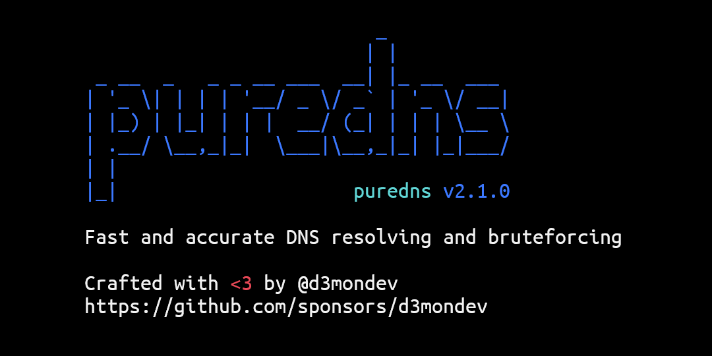
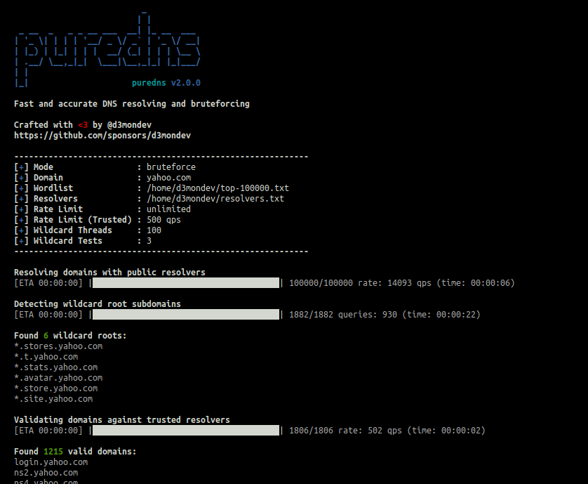

<p align="center">
    
    <a href="https://pkg.go.dev/github.com/d3mondev/puredns/v2"></a>
    
    <a href="https://codecov.io/gh/d3mondev/puredns"></a>
    <a href="https://twitter.com/d3mondev"></a>
</p>

<p align="center"></p>

<p align="center">
    Fast domain resolver and subdomain bruteforcing with accurate wildcard filtering
    <br />
    <a href="#getting-started"><strong>Getting Started »</strong></a>
    <br />
    <br />
    <a href="#usage">Usage</a>
    ·
    <a href="#how-it-works">How it works</a>
    ·
    <a href="#sponsorship">Sponsorship</a>
    ·
    <a href="#faq">FAQ</a>
</p>

# About

**puredns** is a fast domain resolver and subdomain bruteforcing tool that can accurately filter out wildcard subdomains and DNS poisoned entries.

It uses [massdns](https://github.com/blechschmidt/massdns), a powerful stub DNS resolver, to perform bulk lookups. With the proper bandwidth and a good list of public resolvers, it can resolve millions of queries in just a few minutes. Unfortunately, the results from massdns are only as good as the answers provided by the public resolvers. The results are often polluted by wrong DNS answers and false positives from wildcard subdomains.

**puredns** solves this with its wildcard detection algorithm. It can filter out wildcards based on the DNS answers obtained from a set of trusted resolvers. It also attempts to work around DNS poisoning by validating the answers obtained using those trusted resolvers.

Think this is useful? :star: Star us on GitHub — it helps!



## Features

* Resolve thousands of DNS queries per second using massdns and a list of public DNS resolvers
* Bruteforce subdomains using a wordlist and root domains
* Clean wildcards and detect wildcard roots using the minimal number of queries to ensure precise results
* Circumvent DNS load-balancing during wildcard detection
* Validate that the results are free of DNS poisoning by running against a list of known, trusted resolvers
* Save a list of valid domains, wildcard subdomain roots, and a clean massdns output containing only the valid entries
* Read a list of domains or words from stdin and enable quiet mode for easy integration into custom automation pipelines

# Sponsorship
<p align="center"><a href="https://github.com/sponsors/d3mondev"></a></p>
<table>
    <tr>
        <td>
            <p>If my work is earning you money, <a href="https://github.com/sponsors/d3mondev">consider becoming a sponsor</a>! You can earn some unique perks!</p>
            <p>It would also mean A WHOLE LOT ❤️ as it would allow me to continue working for free for the community. But no matter what you do, rest assured that my software will remain free and open-source for you to use.</p>
        </td>
    </tr>
</table>

# Getting Started

## Prerequisites

### massdns
Puredns requires massdns on the host machine. If the path to the massdns binary is present in the PATH environment variable, puredns will work out of the box. A good place to copy the massdns executable is `/usr/local/bin` on most systems. Otherwise, you will need to specify the path to the massdns binary file using the `--bin` command-line argument.

The following should work on most Debian based systems. [Follow the official instructions](https://github.com/blechschmidt/massdns#compilation) for more information.
```
git clone https://github.com/blechschmidt/massdns.git
cd massdns
make
sudo make install
```

### List of public DNS resolver servers

You need to obtain a list of public DNS servers in order to use puredns. [Refer to the FAQ](#how-do-i-get-resolvers-for-use-with-puredns) to learn how to curate your own list of working servers.

## Installation

You can [download a binary release](https://github.com/d3mondev/puredns/releases).

Alternatively, you can compile the latest version easily. First make sure that Go is installed on your system - the last two major releases of Go are supported. Refer to the official [Go installation page](https://golang.org/doc/install) for installation instructions. Then run the following command:

```
go install github.com/d3mondev/puredns/v2@latest
```

# Usage

Make sure to view the complete list of available commands and options using `puredns --help`.


If a `resolvers.txt` file exists in the current working directory, puredns will default to using it. Otherwise, if either `~/.config/puredns/resolvers.txt` or `~/.config/puredns/resolvers-trusted.txt` files are present, puredns will automatically utilize them as resolvers. If none of these options are available, specify the resolvers to use with the --resolvers and --resolvers-trusted arguments.

Specifying trusted resolvers is optional. By default, puredns will simply use 8.8.8.8 and 8.8.4.4.

### Subdomain bruteforcing

Here's how to bruteforce a massive list of subdomains using a wordlist named `all.txt`:

`puredns bruteforce all.txt domain.com`

You can also bruteforce multiple domains at once with the `-d` option to load a text file containing domains instead of specifying a single domain as an argument:

`puredns bruteforce all.txt -d domains.txt`

### Resolving a list of domains

You can also resolve a list of domains contained in a text file (one per line).

`puredns resolve domains.txt`

### Stdin operation

You can pass the list of domains to resolve through stdin:

`cat domains.txt | puredns resolve`

Or a list of words to use for bruteforcing:

`cat wordlist.txt | puredns bruteforce domain.com`

You can also add the `-q` switch to output only the domains found to pipe to other tools:

`cat domains.txt | puredns resolve -q | httprobe`

### Saving the results to files

You can save the following information to files to reuse it in your workflows:

* **domains**: clean list of domains that resolve correctly
* **wildcard root domains**: list of the wildcard root domains found (i.e., *\*.store.yahoo.com*)
* **massdns results file (-o Snl text output)**: can be used as a reference and to extract A and CNAME records.

```
puredns resolve domains.txt --write valid_domains.txt \
                            --write-wildcards wildcards.txt \
                            --write-massdns massdns.txt
```

# How it works


You can see puredns in action against the domain google.com using a small wordlist of the 100k most common subdomains in the image above.

As part of its workflow, puredns performs three steps automatically:

1. Mass resolve using public DNS servers
2. Wildcard detection
3. Validation

#### 1. Mass resolve using public DNS servers

Using massdns, puredns will perform a mass resolve of all the domains and subdomains. It feeds the data to massdns through stdin, which allows it to throttle the number of queries per second if needed and perform basic sanitization on the list of domains generated.

By default, the input domains are set to lowercase, and only entries containing valid characters are accepted (essentially `[a-z0-9.-]`). You can disable this with the `--skip-sanitize` flag.

After this step, the results are usually polluted: some public resolvers will send back bad answers, and wildcard subdomains can quickly inflate the results.

#### 2. Wildcard detection

Puredns then uses its wildcard detection algorithm to detect and extract all the wildcard subdomain roots from the massdns results file.

It will use the massdns output from step 1 as a DNS cache to minimize the number of queries it needs to perform. To ensure precise results, it may have to validate the cache results by performing a DNS query.

You can skip this step using the `--skip-wildcard` flag.

#### 3. Validation

To protect against DNS poisoning, puredns uses massdns one last time to validate the remaining results using trusted DNS resolvers. Currently, the internal trusted resolvers used are `8.8.8.8` and `8.8.4.4`. This step is done at a slower pace to avoid hitting any rate limiting on the trusted resolvers.

You can skip this step using the `--skip-validation` flag.

At this point, the resulting files should be clean of wildcard subdomains and DNS poisoned answers.

# FAQ

### How do I get resolvers for use with puredns?

Trickest maintains a list of valid resolvers here: https://github.com/trickest/resolvers

Alternatively, you can obtain a list of public resolvers from [public-dns.info](https://public-dns.info/nameservers-all.txt), then use the [DNS Validator](https://github.com/vortexau/dnsvalidator) project to keep only resolvers that provide valid answers.

If your public resolvers provide incorrect information to puredns, for example by sending back poisoned replies, some subdomains can be missed as they will get filtered out. ***Hint:*** *Avoid resolvers from countries that censor the internet, like China.*

Once you have a list of custom resolvers, you can pass them to puredns with the `-r` argument or by placing them in a file located at `~/.config/puredns/resolvers.txt`:

`puredns resolve domains.txt -r resolvers.txt`

The default trusted resolvers are currently `8.8.8.8` and `8.8.4.4`. If you do want to change them, you can also specify a custom list with the `--resolvers-trusted` argument or by placing them in a file located at `~/.config/puredns/resolvers-trusted.txt`. I have done many tests to find the best possible trusted resolvers for puredns - make sure to validate your results carefully if you decide to change them, and adjust the rate-limit with `--rate-limit-trusted`.

`puredns resolve domains.txt -r resolvers.txt --resolvers-trusted trusted.txt`

### Why are there domains that do not resolve to an IP address in the results?

Puredns does not simply ignore DNS answers containing NXDOMAIN. Sometimes, those NXDOMAIN answers have valid CNAME records that point to expired domains. If those records are present, they may point to an unregistered domain, allowing for subdomain takeovers.

If you are getting back domains that do not resolve to an IP address, check to see if they contain a CNAME record of interest:

`dig @8.8.8.8 CNAME example.com`

### Why are there wildcards not being filtered out correctly for some domains?

The most likely cause is DNS load balancing - sometimes, you'll get different IP addresses for each unique DNS query made. It can make it very hard to detect wildcard subdomains by comparing their DNS records.

You can specify the number of tests that puredns will perform to gather all the different IP addresses for a subdomain during wildcard detection. The default number is 3 tests, which is very low. I've seen domains with a lot of balancing take more than 50 queries to return results that were not perfect but good enough.

You can try to increase the number of tests performed to detect wildcard subdomains with the `--wildcard-tests` argument:

`puredns resolve domains.txt --wildcard-tests 50`

### Why does puredns crash with an out-of-memory error when resolving very large lists?

To detect wildcards, puredns needs to keep a cache of the DNS answers found. If your list of domains is in the hundreds of millions and contains many wildcard subdomains, the host can run out of memory. But there's an easy solution.

By default, puredns puts all the domains in a single batch to save on the number of DNS queries and execution time. If memory is a concern, it's possible to process the domains in multiple smaller batches with the `--wildcard-batch` argument. I have found a good size to be between 1M and 2M subdomains for a VPS with 1GB RAM.

`puredns resolve domains.txt --wildcard-batch 1000000`

### Why do the results sometimes contain duplicate domains?

Puredns does not remove duplicates anywhere in its pipeline. If the input file contains duplicate items such as identical words or domains, puredns will output duplicate elements. You can ensure that the input files provided to puredns are free of duplicates by using a tool like `sort -u`.

### Why do the results sometimes contain unrelated domains?

It is likely due to the public resolvers used. Some of them will sometimes return answers unrelated to the queries, leading to random domain names in the output. Puredns does not currently handle this case and leaves it to the user to sanitize the output to ensure the domains found respect the scope.

# Resources

[public-dns.info](https://public-dns.info/) continuously updates a list of public and free DNS resolvers.

[DNS Validator](https://github.com/vortexau/dnsvalidator) can be used to curate your own list of public DNS resolvers.

[all.txt wordlist](https://gist.github.com/jhaddix/f64c97d0863a78454e44c2f7119c2a6a) Jhaddix's iconic `all.txt` wordlist is commonly used for subdomain enumeration.

[shuffleDNS](https://github.com/projectdiscovery/shuffledns) is a good alternative written in go that handles wildcard subdomains using a different algorithm.

# Contributions

You can contribute to puredns in the following ways:

* [Submit new feature ideas](https://github.com/d3mondev/puredns/issues)
* [Report bugs](https://github.com/d3mondev/puredns/issues) as issues
* Star ⭐ this repository
* Spread the word about puredns
* [Become a sponsor](https://github.com/sponsors/d3mondev) 🥇 and earn unique perks

Do you have an idea for an amazing new feature? Did you find a bug you want to fix? Great! Feel free to [submit an issue](https://github.com/d3mondev/puredns/issues) for discussion before making a pull request.

I will not be accepting pull requests for trivial changes such as typo corrections, best practices, minor fixes, etc.

# Disclaimer & License

Any resolvers included in this repository are present for reference only. The author is not responsible for any misuse of the resolvers in that list. It is the user's responsibility to curate a list of resolvers you are authorized to use.

Usage of this program for attacking targets without consent is illegal. It is the user's responsibility to obey all applicable laws. The developer assumes no liability and is not responsible for any misuse or damage caused by this program. Please use responsibly.

The material contained in this repository is licensed under GNU GPLv3.
